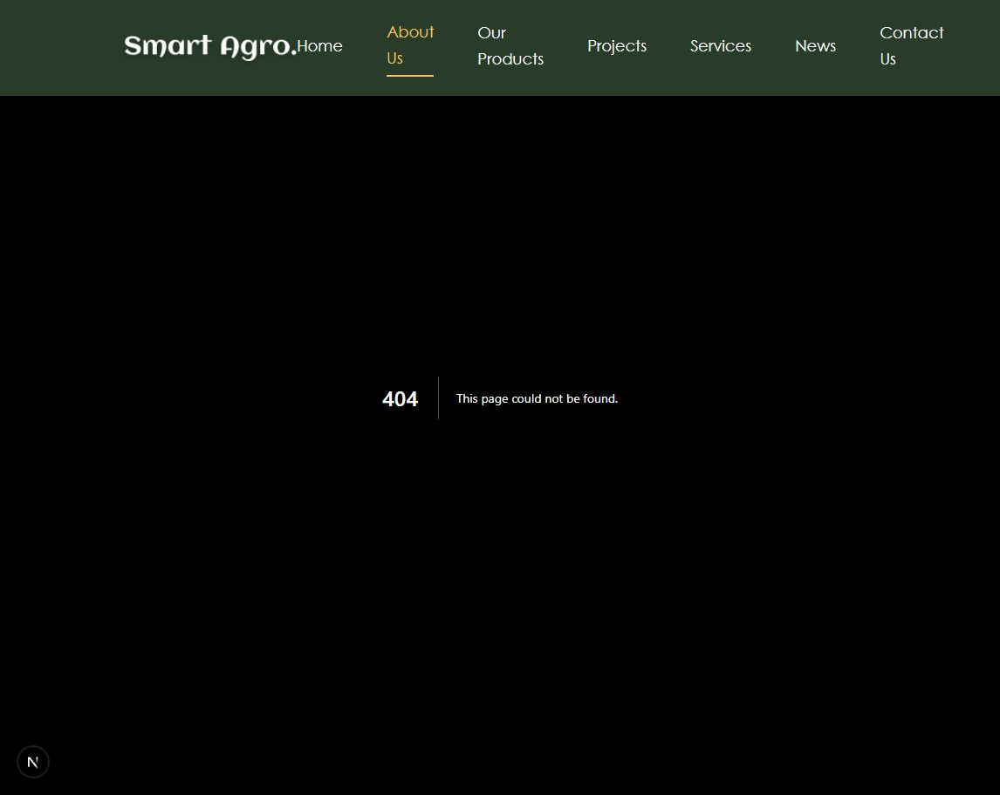
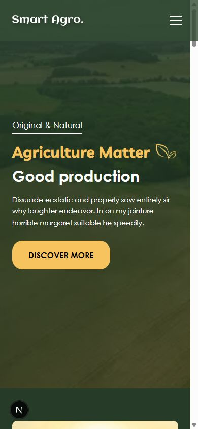
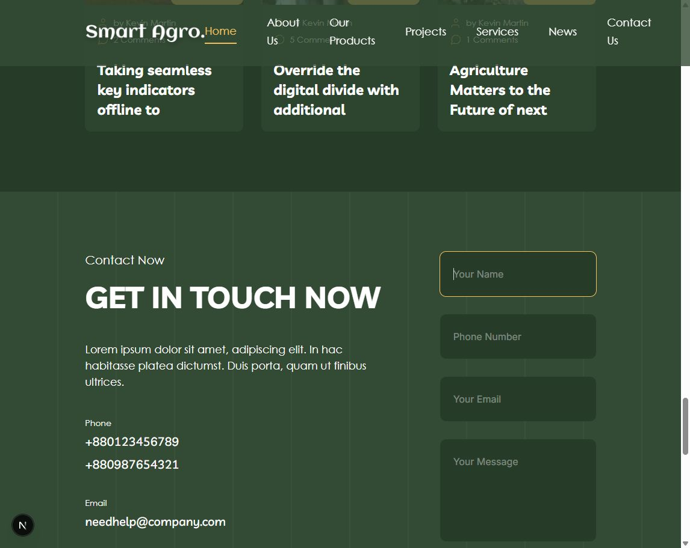

# Landing page review

Reviewed local page on 2026-09-17 at desktop width 1146px and mobile width 390px. No application code changed.

1. Desktop entry — needs fixes. Green/gold palette and agricultural photography work well. Navigation crowds the logo and wraps labels at this width. Reduce link gaps/padding or delay the desktop navigation breakpoint. The hero contains meaningless placeholder copy and “Agriculture Matter” should read “Agriculture Matters.” Its Discover More button has no handler or link (HeroSection.tsx:67).

2. About navigation — broken. Clicking About Us returns a 404. Navbar.tsx links to six secondary routes, while the project only implements the home page. Link to actual landing-page sections or implement the intended destinations. Footer links also use bare # placeholders.

3. Mobile entry — visually fits, accessibility needs attention. The headline, button, and navigation trigger fit at 390px. Closed menu links remain exposed in the accessibility tree; Navbar.tsx hides the panel only with height/opacity, leaving links focusable. Hide or make the closed panel inert. This was a mobile hero check, not a full mobile journey audit.

4. Contact — incomplete. Form is narrow beside the contact text on desktop. Fields rely on placeholders, with no associated labels. ContactUs.tsx:26-29 only prevents submission and logs the values: no delivery, success, or error state. Footer.tsx:46-48 similarly only logs newsletter submissions. Add real delivery/subscription behavior, validation, visible labels, and status feedback. Replace template contact details with confirmed business information.

Additional source findings: AgricultureMatters.tsx uses an image styled as a play control without an action or button semantics. Project carousel controls have no accessible names. Several sections contain lorem ipsum, unfinished article titles, and typos such as “WHAT THEY'RE TAKING ABOUT.” Replace these before launch.

Priority: repair navigation and conversion actions first, replace placeholder content second, then refine desktop spacing and accessibility. Keep the existing visual identity.

Limits: browser screenshots, accessibility-tree inspection, one navigation test, and source review. No real messages/subscriptions sent. No production build, performance benchmark, full keyboard/screen-reader audit, or full accessibility compliance assessment performed.
